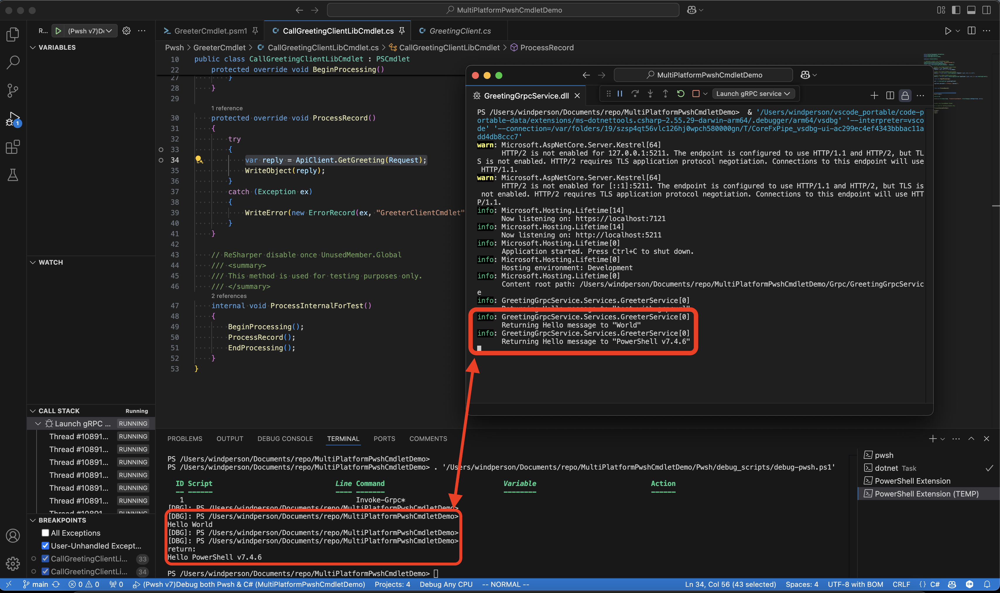

# MultiPlatformPwshCmdletDemo

This is a demo project for a multi-platform PowerShell module. The module is a simple one that contains a single cmdlet, `Get-HelloWorld`. The cmdlet writes "Hello, World!" to the console, or if you give {postfix} parameter, it will show "Hello {postfix}" .

The string is return from an ASP.NET Core gRPC service project, which is located in the `Grpc\GreetingGrpcService` folder. 